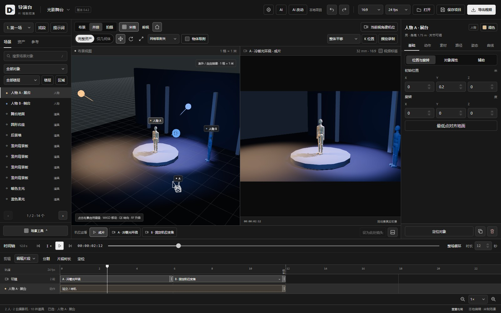
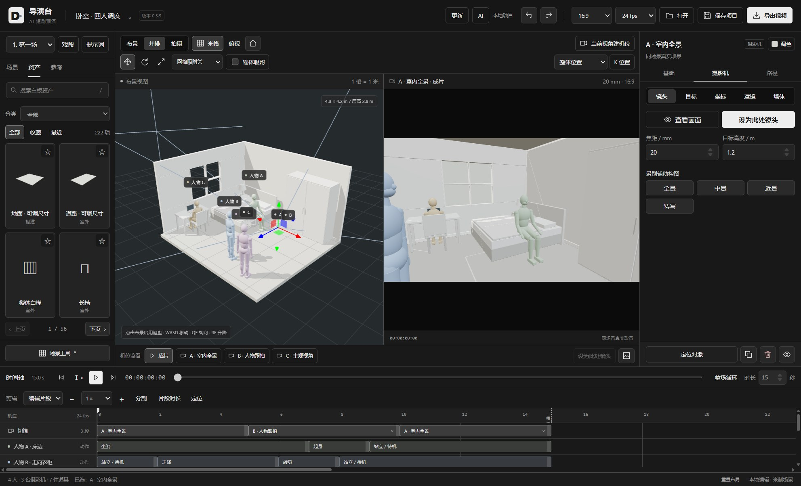
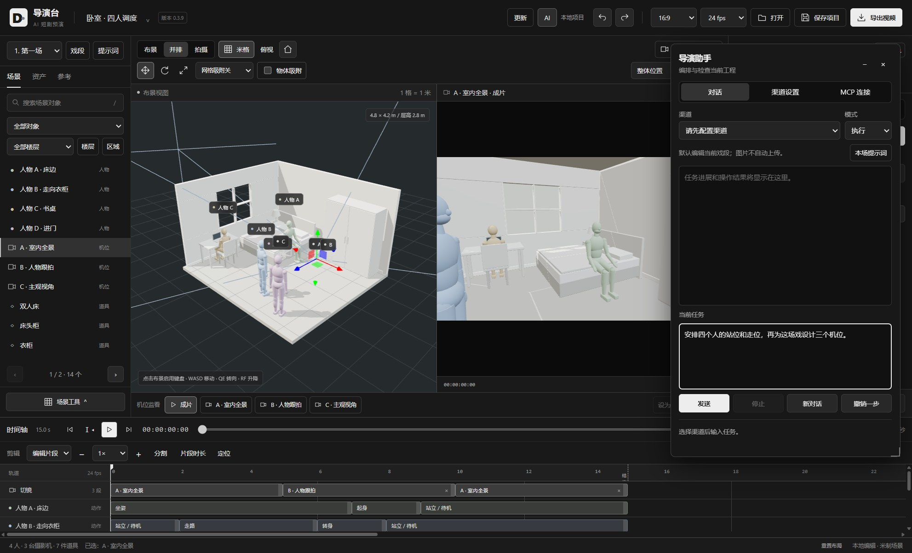

# 导演台 · DirectorDesk

面向 AI 短剧和视频创作的三维预演工具。先搭场景、排人物走位和运镜，再导出参考视频。支持手动制作，也支持 AI 助手和 MCP Agent 直接操作工程。

[下载 Windows 版](https://github.com/mangfufu/director-desk/releases/latest) · [获取配套 skill](https://github.com/mangfufu/director-desk/releases/latest) · [MIT License](LICENSE)



## 能做什么

| 功能 | 用法 |
| --- | --- |
| 白模搭景 | 使用人物、动物、家具、建筑、道路和道具，调整尺寸、颜色与摆放位置 |
| 场景模板 | 从卧室、室外场景、光影舞台、变焦长廊和夜街追逐开始制作，也可从空白场地搭建 |
| 仅几何体 | 用六种基础几何体组合、上色，快速表达人物和场景；AI 按需检索资产 |
| 导入模型 | 导入 GLB/glTF、FBX 和 OBJ 资源，随工程保存 |
| 人物调度 | 编排站位、走位路径、基础动作和群演，支持手持道具绑定 |
| 用户动作库 | 导入骨架动作或收藏模型自带动作，预览、搜索并跨工程使用 |
| 操控录制 | 用键盘控制白模移动，将走位录成可继续编辑的路径 |
| 摄影机与运镜 | 从三维场景真实取景，编排多机位路径、视线、跟随、POV 和切镜 |
| 镜头效果与光影 | 运镜预设、希区柯克变焦、手持、畸变与景深；摆放灯光，调整环境与灯光关键帧 |
| 曲线编辑 | 拖动控制柄调整路径、镜头和灯光的变化速度，插入停留并定位关键帧区间 |
| AI 修改定位 | 查看内置助手与 MCP 的成功修改，点击跳到对应戏段、对象和时间 |
| 时间轴编辑 | 缩放、拖动、分割片段、调整时长，手动记录位置关键帧 |
| 多场戏接拍 | 同工程切换独立戏段，从上一段末帧继承场景和人物状态 |
| 视频与提示词 | 单场或批量导出戏段视频，可修改输出文件名；导出工程和素材包，可选人物名字标签；各戏段独立保存配套视频提示词 |
| AI 协作 | 内置助手与外部 MCP Agent 查询空间、编辑当前工程、检查和修正调度 |
| 自定义技能 | 导入自己的 SKILL.md 或技能目录，从 GitHub 下载技能，自由启用、停用和更新 |

### 资产与摄影机

选择白模搭建场景，调整人物和道具，再设置摄影机的景别、目标与运动路径。



### 让 AI 直接操作

**内置导演助手**：配置模型渠道后，用自然语言提出搭景、走位或镜头调整要求。助手窗口支持拖动、缩放和收起。

**MCP Agent**：在软件的 **AI → MCP 连接** 中复制连接配置，让 Agent 读取内置 `director_skill`，即可操作当前工程。它能查询指定时刻的位置与空间关系，再继续修改场景、机位和分镜。

配套 skill 随软件提供，也支持生成可导入网页版本的 `.director` 工程文件。

**自定义技能（桌面版）**：打开 **AI → 技能**，导入 `SKILL.md` 或包含它的整个文件夹；也可以粘贴公开 GitHub 技能目录链接下载。启用后助手会根据任务按需读取，外部 Agent 用 `director_skill({action:"list"})` 查看启用列表，再用 `id` 读取正文、`path` 读取附属文本。停用从下一次任务生效，已有对话完整保留。外部 Agent 应重新查询列表以了解开关变化。

用户技能独立保存在本机配置目录，软件更新不覆盖它们。可打开目录修改文件，再点“重新加载”；GitHub 来源可点“更新”。内置技能也可停用。附属脚本随包保留，内置助手当前使用说明与文本参考，不会自动执行脚本。

制作自己的技能只需一个文件夹，根部放 `SKILL.md`，例如：

```markdown
---
name: 我的创作方法
description: 编排动作戏时使用，强调人物目标和空间变化。
---
按用户确认的剧情编排追逐，明确逃跑路线、障碍和双方反应。
需要进一步的示例时读取 references/examples.md。
```

参考资料可放入 `references/`，也可使用自己的子目录。使用第三方技能时保留其许可说明。



## 开始使用

1. 从 [Releases](https://github.com/mangfufu/director-desk/releases/latest) 下载 Windows 安装包或免安装 ZIP。
2. 安装后启动，或完整解压 ZIP 后运行 `DirectorDesk.exe`。
3. 选择场景模板，加入人物与道具，在时间轴上安排动作和镜头。
4. 播放预览，导出参考视频；点击戏段旁的“提示词”查看、编辑或导出配套文案。

支持常见横竖画幅与帧率。工程可保存为文件，之后继续编辑或交给 Agent 调整。
桌面版可在“文件位置”设置默认工程和导出目录，退出时可选择保存并退出、不保存退出或取消。

导出窗口选择“批量戏段”，勾选需要的戏段并编辑文件名。每场分别输出视频，沿用各自的画幅、时长和切镜；桌面版可直接保存到默认导出目录，同名文件自动编号。输出文件重命名不改变工程中的戏段名称。

“用户动作库”可导入带骨架动画的 FBX、GLB/glTF，包括没有人物网格的独立动作；支持预览、命名、搜索、骨架映射和跨工程收藏。选中人物后添加到时间轴，也可以从导入模型的“动画”页收藏自带动作。已应用的源素材随工程保存，删除本机收藏不影响工程；MCP 和内置 AI 可按名称查询、应用用户动作。

Windows 桌面版在“更新”中默认同时检查网站和 GitHub 最新正式 Release，取较新版本，也可选择单个来源。安装版支持下载后手动重启安装；免安装版从下载页获取新版 ZIP。检查不会自动下载或安装。

## 本地开发

准备 Node.js 24+ 和 npm：

```bash
git clone https://github.com/mangfufu/director-desk.git
cd director-desk
npm ci
npm run dev
```

按终端显示的地址打开网页。构建网页和 Windows 桌面版：

```bash
npm run build
npm run desktop:pack
```

macOS（Apple Silicon）构建 DMG：

```bash
npm run desktop:pack:mac
```

网页产物位于 `dist/`，桌面交付文件位于 `release/`（Windows 为 `DirectorDesk-Setup-<版本>.exe`，macOS 为 `DirectorDesk-<版本>-arm64.dmg`）。桌面构建使用本机 Chrome，可通过 `CHROME_PATH` 指定浏览器。macOS 包未做签名和公证，首次打开如被 Gatekeeper 拦截，请右键点击应用选择“打开”；macOS 版暂不支持应用内自动更新，请从发布页下载新版本。

发布 Windows GitHub Release 时，将构建生成的 `release/latest.yml` 与同版本安装包一起上传，保留文件名。更新客户端按清单校验下载包；缺少清单的历史 Release 仍可检测版本并打开下载页。

| 目录 | 内容 |
| --- | --- |
| `src/` | 场景、编辑器、动画、渲染和共用自动化工具 |
| `desktop/` | 桌面入口、AI 协议、MCP 服务和更新客户端 |
| `skills/director-desk/` | 技能说明与离线工程工具 |
| `scripts/`、`tests/` | 构建与验证工具 |

## 许可证

项目自有代码采用 [MIT](LICENSE) 许可证。第三方依赖和动作素材保留各自许可，内置动作来源见 [NOTICE](src/animation/library/NOTICE.txt)。
